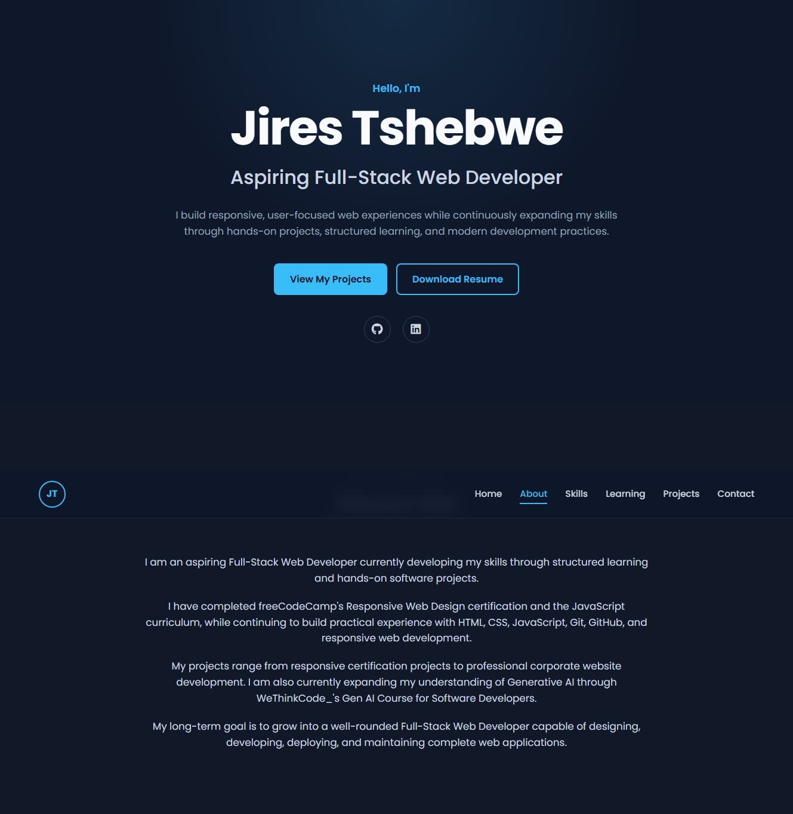

# Jires Tshebwe — Developer Portfolio



## About This Portfolio

This repository contains my personal developer portfolio website.

The portfolio showcases my web development skills, certifications, practical projects, and progression toward full-stack development.

The website is continuously updated as I complete new learning milestones and build new projects.

## Live Portfolio

https://tshebwej7.github.io/portfolio-website/

## About Me

I am a **Junior Web Developer building toward Full-Stack Development**, focused on creating responsive, interactive, and user-friendly web experiences.

My development journey combines structured learning through **freeCodeCamp** and **WeThinkCode_** with practical project development, Git/GitHub workflows, responsive UI implementation, deployment, and Generative AI-assisted software development.

I have completed freeCodeCamp's **Responsive Web Design certification** and **JavaScript curriculum**.

I am also **certified in Generative AI for Software Development through WeThinkCode_**, with practical experience applying Generative AI to code comprehension, documentation, debugging, testing, refactoring, and software-development workflows.

## Skills & Technologies

### Frontend Development

- HTML5
- CSS3
- JavaScript
- Responsive Web Design
- Tailwind CSS
- Flexbox
- CSS Grid
- Chart.js

### Development Tools

- Git
- GitHub
- Visual Studio Code
- Browser Developer Tools
- GitHub Pages

### Generative AI for Software Development

- AI-assisted coding
- Code comprehension
- Documentation
- Debugging
- Testing
- Refactoring
- Code verification
- Learning frameworks, libraries, and APIs
- AI-assisted development workflows

## Certifications & Completed Learning

### Responsive Web Design — freeCodeCamp

**Status: Certified**

Completed the Responsive Web Design certification, developing practical skills in HTML, CSS, responsive layouts, accessibility, Flexbox, CSS Grid, and modern responsive web development.

### JavaScript — freeCodeCamp

**Status: Completed**

Completed the JavaScript curriculum, developing practical knowledge of JavaScript programming and interactive web development.

### Generative AI for Software Development — WeThinkCode_

**Status: Certified**

Earned certification in Generative AI for Software Development, with practical exposure to using Generative AI for code understanding, documentation, debugging, testing, refactoring, code assistance, and learning software technologies.

## Featured Projects

### Elsha Trading Solution

A professional corporate website developed for **Elsha Trading Solution**, a South African electrical contracting company.

The project focuses on a modern, responsive, accessible, and professional digital presence while presenting the company's services, projects, team, and business information.

**Technologies:** HTML5, Tailwind CSS, JavaScript

### The Fade Room

A professional responsive barber shop website developed as part of the **Talent Forge Junior Full-Stack Developer Practical Assessment**.

The project demonstrates a complete customer journey from discovering services to selecting a service, choosing a barber, scheduling an appointment, entering customer information, and adding the appointment to a personal calendar.

**Live Website:** https://tshebwej7.github.io/the-fade-room-website/

**Technologies:** HTML5, CSS3, JavaScript, Tailwind CSS, Google Fonts, Google Calendar integration, Apple Calendar-compatible `.ics` generation

### Admin Dashboard

A responsive admin dashboard demonstrating JavaScript application interfaces, dark mode, localStorage persistence, sidebar navigation, statistics cards, recent orders, and Chart.js data visualization.

**Live Website:** https://tshebwej7.github.io/admin-dashboard/

**GitHub:** https://github.com/tshebwej7/admin-dashboard

### AI Code Exercises

A practical collection of software-development exercises exploring code comprehension, documentation, debugging, testing, refactoring, performance optimization, and AI solution verification.

**GitHub:** https://github.com/tshebwej7/ai-code-exercises

## Other Projects

### SmartWatch Pro Landing Page

Responsive product landing page built with HTML5 and CSS3.

**Live:** https://tshebwej7.github.io/SmartWatch-Pro-Landing-Page/

**GitHub:** https://github.com/tshebwej7/SmartWatch-Pro-Landing-Page

### Python Technical Documentation

Responsive technical documentation website demonstrating structured content, navigation, readable typography, and responsive design.

**Live:** https://tshebwej7.github.io/python-technical-documentation/

**GitHub:** https://github.com/tshebwej7/python-technical-documentation

### Developer Survey Form

Responsive survey application demonstrating structured forms, user input elements, accessibility, and JavaScript interaction.

**Live:** https://tshebwej7.github.io/developer-survey-form/

**GitHub:** https://github.com/tshebwej7/developer-survey-form

### BookVault Inventory App

Web application project demonstrating book inventory management, responsive UI, reading status, ratings, and practical frontend development.

**Live:** https://tshebwej7.github.io/book-inventory-app/

**GitHub:** https://github.com/tshebwej7/book-inventory-app

## Development Journey

**Responsive Web Design → JavaScript → Generative AI for Software Development → Practical Web Development Projects → Interactive Web Applications → Professional Website Development → Full-Stack Development**

The next stages of my development journey include deeper work with backend technologies, APIs, databases, authentication, and complete full-stack applications.

## Portfolio Features

- Responsive design
- Mobile navigation
- Semantic HTML
- Accessible navigation
- Project showcases
- Live project links
- GitHub repository links
- Smooth scrolling
- Scroll animations
- Mobile-friendly layouts
- Resume download
- GitHub integration
- LinkedIn integration
- SEO-friendly metadata
- Reduced-motion accessibility support

## Development Workflow

This portfolio is developed and maintained using Git and GitHub.

```bash
git status
git add .
git commit -m "Update portfolio"
git push
```

The website is deployed using GitHub Pages.

## Continuous Development

This portfolio is an ongoing project.

As I continue developing my full-stack skills, I will continue adding new projects, technologies, certifications, and professional experience.

Future areas of development include:

- Backend development
- APIs
- Databases
- Authentication
- Full-stack applications
- Modern JavaScript frameworks
- Additional professional projects

## Connect With Me

**GitHub:** https://github.com/tshebwej7

**LinkedIn:** https://www.linkedin.com/in/tshebwej7/

## Author

**Jires Tshebwe**

Junior Web Developer | Building Toward Full-Stack Development

© 2026 Jires Tshebwe. All rights reserved.
